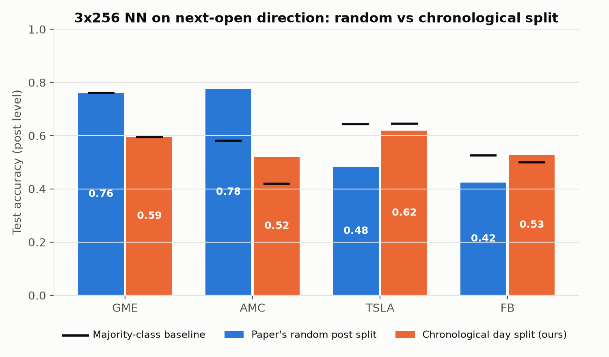

# Predicting Stock Movement from Reddit WallStreetBets Posts

UE24CS352A Machine Learning mini-project.

We replicate the CS229 report *"Predicting market volatility and building short-term trading strategies
using data from Reddit's WallStreetBets"*, then evaluate it again without data leakage.

- **Replication:** 7 features per post (score, comments, length, VADER sentiment, bias), logistic
  regression solved with Newton's method (written from scratch), and a 3×256 neural network. This
  reproduces the paper's Table 1 and Fig. 3.
- **Our change:** the paper splits posts at random, so posts from the same day end up in both train
  and test. We add a chronological split (train on earlier days, test on later days), a
  majority-class baseline, and macro-F1 / ROC-AUC alongside accuracy.

## Results

Paper's random split, label = next-day open is higher (test accuracy, mean of 5 runs):

| Stock | NN (ours / paper) | LogReg (ours / paper) | Random guess | Majority class |
|---|---|---|---|---|
| GME | 0.77 / 0.84 | 0.77 / 0.72 | 0.51 | 0.77 |
| AMC | 0.75 / 0.82 | 0.62 / did not converge | 0.49 | 0.61 |
| TSLA | 0.56 / 0.64 | 0.61 / 0.74 | 0.52 | 0.62 |
| FB | 0.55 / 0.69 | 0.58 / 0.68 | 0.54 | 0.63 |

With the chronological split, both models are close to the majority-class baseline and ROC-AUC is
about 0.5. For example, AMC's NN AUC drops from 0.83 (random split) to 0.48 (chronological split).
Our conclusion: the paper's accuracies come mainly from class imbalance and leakage, not from
real predictive power. More detail is in [`reports/member_b_results.md`](reports/member_b_results.md).



## Setup

Tested with Python 3.14 on macOS. Python 3.10 or newer should work.

```bash
git clone https://github.com/SaiNikitha1901/ML-Miniproject.git
cd ML-Miniproject
python3 -m venv .venv
source .venv/bin/activate          # Windows: .venv\Scripts\activate
pip install -r requirements.txt
```

### Get the data

The Reddit dataset is the Kaggle dataset
[Reddit WallStreetBets Posts](https://www.kaggle.com/datasets/gpreda/reddit-wallstreetsbets-posts).
Note the spelling `wallstreetsbets` in the URL. It is not committed because it is large. Download it
and place `reddit_wsb.csv` in `data/raw/`:

```bash
mkdir -p data/raw
curl -L -o data/raw/wsb.zip https://www.kaggle.com/api/v1/datasets/download/gpreda/reddit-wallstreetsbets-posts
unzip data/raw/wsb.zip -d data/raw     # gives data/raw/reddit_wsb.csv
```

If `curl` fails, download the zip from the Kaggle page in a browser and unzip it into `data/raw/`.

Stock prices are downloaded automatically from Yahoo Finance, so an internet connection is needed.

## How to run

Run everything from the repo root:

```bash
python run_all.py               # full pipeline, about 3 minutes
python run_all.py --skip-data   # reuse the feature files, rerun only labels, models and evaluation
```

Or run each stage on its own, in this order:

| # | Command | What it does | Output |
|---|---|---|---|
| 1 | `python src/data/make_dataset.py` | Cleans text, finds ticker mentions, plots Fig. 2 | `data/processed/cleaned_wsb.pkl`, `reports/figures/figure_2_mentions_histogram.png` |
| 2 | `python src/features/build_features.py` | VADER sentiment and per-post features for GME, AMC, TSLA, FB | `data/processed/features_<T>.parquet` |
| 3 | `python src/data/fetch_prices.py` | Daily prices from Yahoo Finance (FB is fetched as META) | `data/processed/prices_<T>.parquet` |
| 4 | `python src/labels/build_labels.py` | Up/down, significant-move and volatility labels | `data/processed/labels_<T>.parquet` |
| 5 | `python -m src.models.train_replication` | Paper's Table 1 (random split) and Newton convergence plot | `reports/table1_replication.csv`, `reports/figures/figure_3_newton_convergence.png` |
| 6 | `python -m src.eval.evaluate_chronological` | Chronological split, baselines, all metrics | `reports/results_chronological.csv`, `reports/figures/leakage_random_vs_chronological.png` |

Steps 5 and 6 use `python -m` because they import shared code from `src/`.

The EDA notebook is `notebooks/01_eda_and_features.ipynb`. Start Jupyter from inside `notebooks/`
(`cd notebooks && jupyter notebook`), because its file paths begin with `../`. Run steps 1–2 first.

## Repository structure

```
├── run_all.py                     # runs the whole pipeline
├── requirements.txt
├── data/                          # not committed; created by the pipeline
│   ├── raw/reddit_wsb.csv
│   └── processed/                 # features, prices and labels (.parquet)
├── notebooks/
│   └── 01_eda_and_features.ipynb  # exploratory analysis
├── reports/
│   ├── figures/                   # all plots
│   ├── table1_replication.csv
│   ├── results_chronological.csv
│   └── member_b_results.md        # detailed results and findings
└── src/
    ├── data/       make_dataset.py, fetch_prices.py
    ├── features/   build_features.py, split_data.py
    ├── labels/     build_labels.py
    ├── models/     dataset.py, logreg_newton.py, neural_net.py, train_replication.py
    └── eval/       evaluate_chronological.py, metrics.py, plot_style.py
```

## Method details

- **Label (paper):** `y_dir = 1` if the next trading day's open is higher than the open on the
  post's day. Weekend and holiday posts count toward the next trading day.
- **Extra labels:** `y_sig` is 1 when the move is larger than the median move of the previous 20
  days. `y_vol` is 1 when the next day's high–low range is above its 20-day median. Both use only
  past data.
- **Newton logistic regression:** NumPy, stops when the weight change is below 1e-6. Its predictions
  are checked against scikit-learn.
- **Neural network:** 3 hidden layers of 256 ReLU units and a sigmoid output, Adam (lr 0.001), 30
  epochs, batch size 16 (64 for GME and TSLA), as in the paper. It uses scikit-learn's
  `MLPClassifier`, so TensorFlow/PyTorch are not needed.
- **Chronological split:** first 80% of trading days for training, last 20% for testing. Whole days
  stay on one side, so no day appears in both sets.
- All random seeds are fixed, so the results are reproducible.

## Team

| Member | Role | Work |
|---|---|---|
| P. Samreen (PES2UG24AM108) | Member A: data and features | Data cleaning, ticker detection, VADER sentiment features, mention histogram, EDA notebook, post-level chronological split |
| Sai Nikitha Perumalla (PES2UG24AM142) | Member B: labels, models and evaluation | Price data and labels, Newton logistic regression, neural network, Table 1 replication, chronological evaluation, `run_all.py` |
